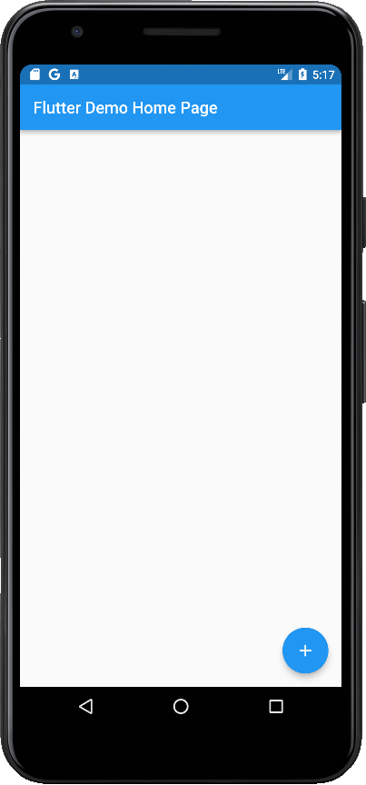
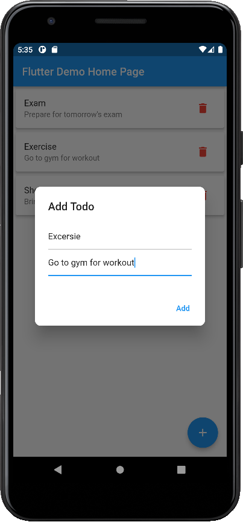
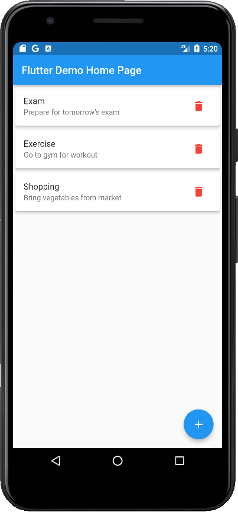
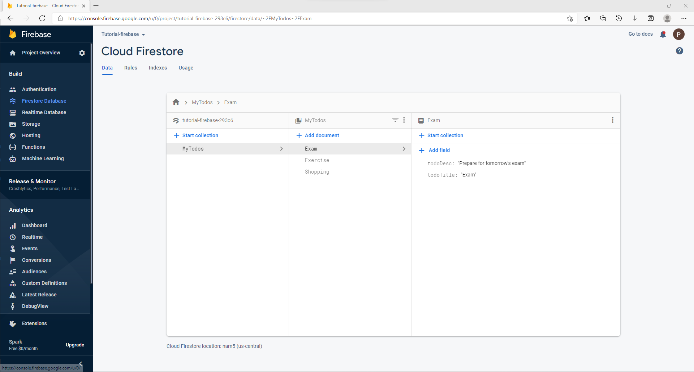

# To Do List Firebase Application

In this application, user can create new tasks and delete the unwanted tasks. All the tasks that are created by user gets stored in the database, and also data is deleted if user deletes any task. For database I have used Firebase Firestore.

 

  
  
  

 

